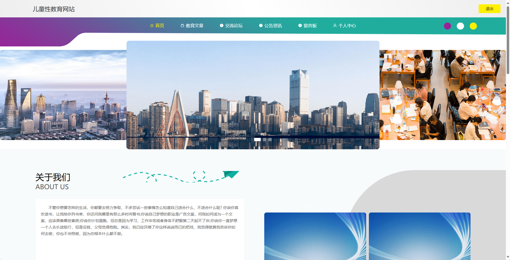
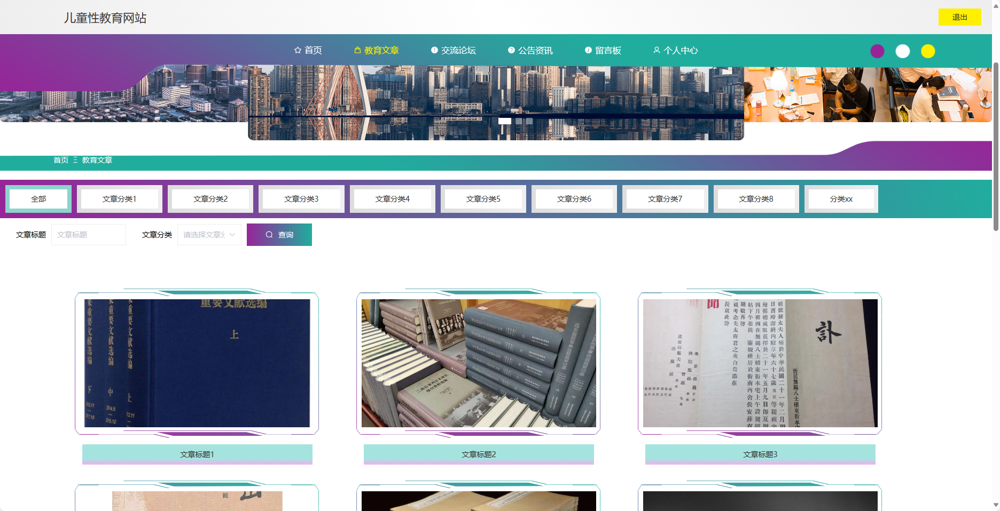
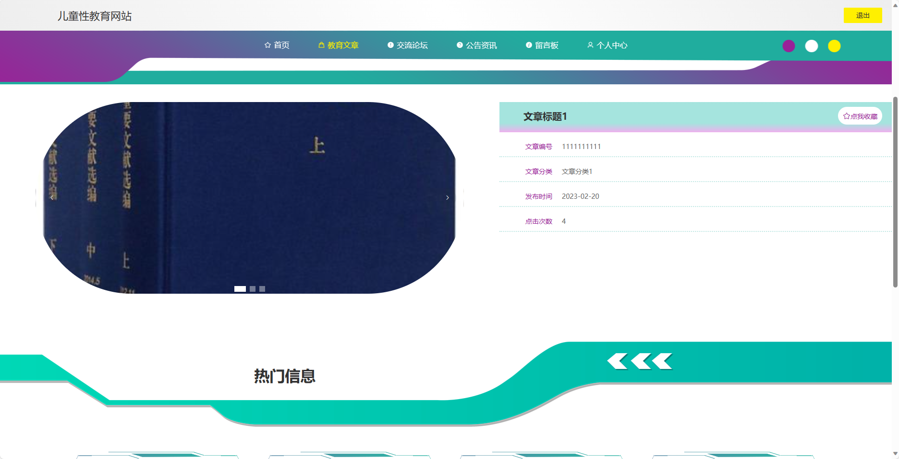
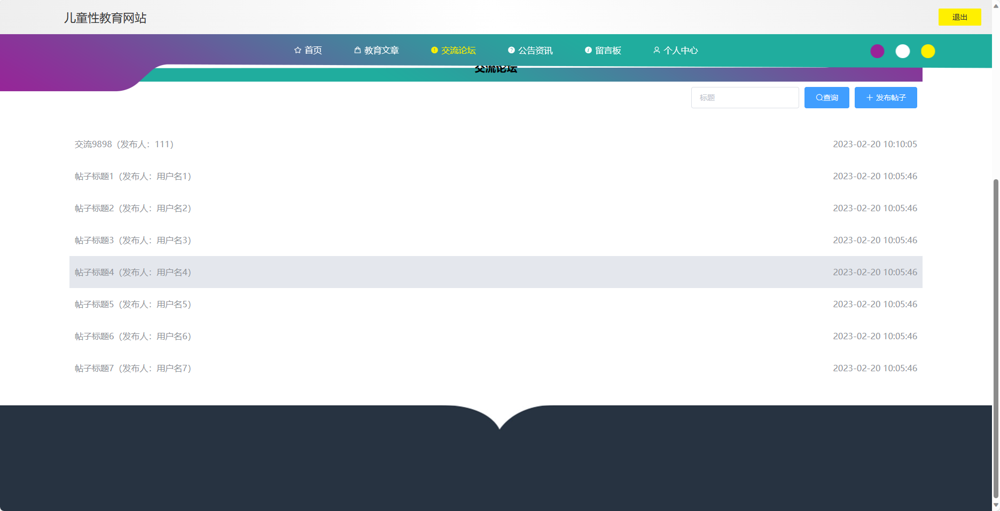
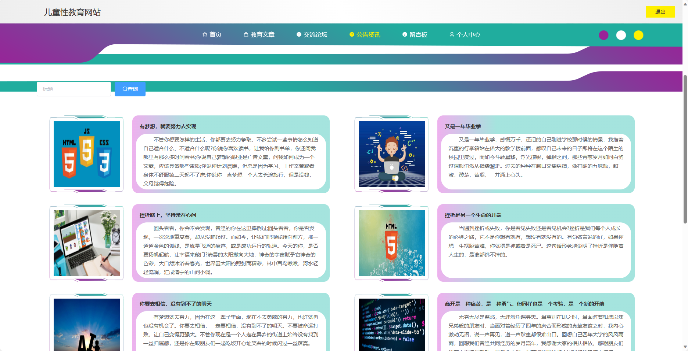
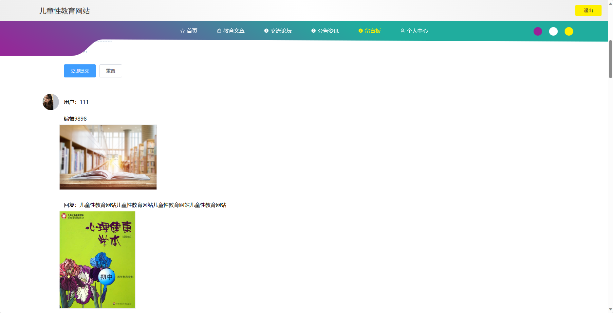
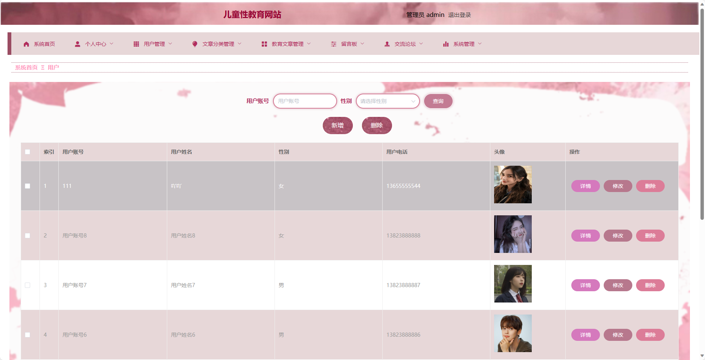
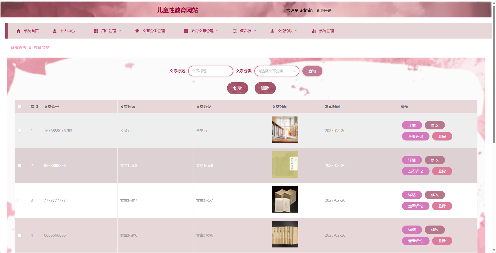
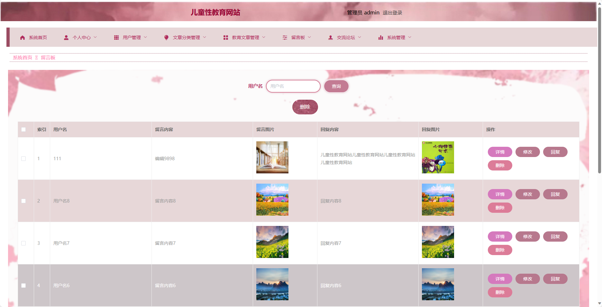
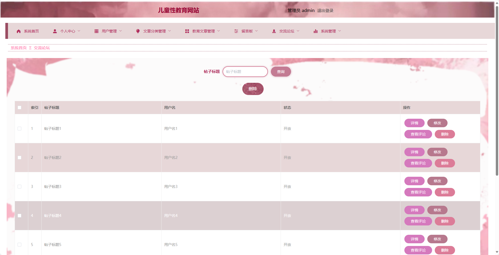

## 基于SpringBoot的儿童性教育网站

- <b>完整代码获取地址：从戎源码网 ([https://armycodes.com/](https://armycodes.com/))</b>
- <b>技术探讨、资料分享，请加QQ群：692619798</b> 
- <b>作者微信：19941326836  QQ：952045282</b> 
- <b>承接计算机毕业设计、Java毕业设计、Python毕业设计、深度学习、机器学习</b>
- <b>选题+开题报告+任务书+程序定制+安装调试+论文+答辩ppt 一条龙服务</b>
- <b>所有选题地址 ([https://github.com/YuLin-Coder/AllProjectCatalog](https://github.com/YuLin-Coder/AllProjectCatalog)) </b>

## 项目介绍
基于SpringBoot的儿童性教育网站，系统包含两种角色：管理员、用户,系统分为前台和后台两大模块，主要功能如下。

### 【管理员】:
1. 管理员个人中心：管理员可以管理个人信息，包括修改密码、查看个人资料等。
2. 用户管理：管理员可以对用户进行管理，包括查看用户列表、禁用用户等操作。
3. 文章分类管理：管理员可以管理文章的分类，包括新增、编辑、删除分类等。
4. 教育文章管理：管理员可以管理教育文章，包括发布、编辑、删除文章等。
5. 留言板：管理员可以查看用户留言，并进行回复和删除操作。
6. 交流论坛：管理员可以查看用户发布的帖子，进行删除、置顶等操作。
7. 系统管理：包括网站设置、日志管理等系统级别的管理功能。

### 【前台】:
1. 首页：展示网站的概况和最新资讯。
2. 教育文章：提供儿童性教育相关的文章。
3. 交流论坛：提供用户间交流的平台。
4. 公告资讯：发布关于网站更新、活动通知等重要信息。
5. 留言板：用户可以留言交流，提出建议或反馈问题。
6. 个人中心：用户可以管理个人信息、查看自己的帖子和留言记录等。

## 项目技术
- 编程语言：Java
- 数据库：MySQL
- 项目管理工具：Maven
- 前端技术：HTML、CSS、JavaScript、Jquery、Vue
- 后端技术：Spring、SpringMVC、MyBatis

## 运行环境
- JDK版本：JDK1.8及以上
- 开发工具：IDEA、Ecplise、Myecplise都可以
- 数据库: MySQL5.7及以上
- Maven：maven3.0及以上
- Node：14.14.0及以上

## 运行截图

